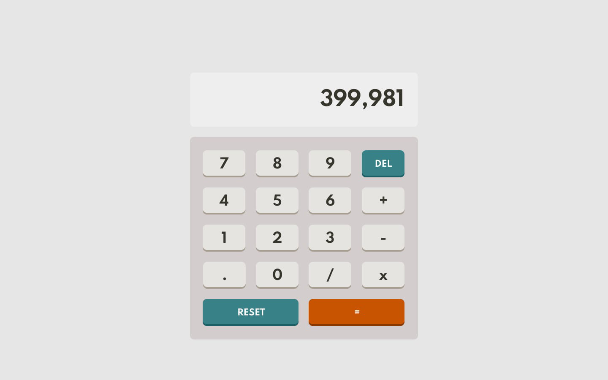

# Nexum - Calculator app

## Welcome! 👋

Thanks for checking out this front-end coding challenge.

challenges help you improve your coding skills by building realistic projects.

**To do this challenge, you need a good understanding of HTML, CSS and JavaScript.**

## The challenge

Your challenge is to build out this calculator app and get it looking as close to the design as possible.

You can use any tools you like to help you complete the challenge. So if you've got something you'd like to practice, feel free to give it a go.

Your users should be able to:

- See the size of the elements adjust based on their device's screen size
- Perform mathematical operations like addition, subtraction, multiplication, and division
- Adjust the color theme based on their preference

## Where to find everything

Your task is to build out the project to the designs inside the `/design` folder. You will find both a mobile and a desktop version of the design. 

The designs are in JPG static format. Using JPGs will mean that you'll need to use your best judgment for styles such as `font-size`, `padding` and `margin`. We do not expect perfection in them.

There is also a `style-guide.md` file containing the information you'll need, such as color palette and fonts.

## Building your project

Feel free to use any workflow that you feel comfortable with. Below is a suggested process, but do not feel like you need to follow these steps:

1. Initialize your project as a public repository on [GitHub](https://github.com/). Creating a repo will make it easier to share your code. If you're not sure how to do this, [have a read-through of this Try Git resource](https://try.github.io/).
2. Publish your code to a web address. This will also be useful you can share the URL for your project.
3. Look through the designs to start planning out how you'll tackle the project. This step is crucial to help you think ahead for CSS classes to create reusable styles.
4. Before adding any styles, structure your content with HTML. Writing your HTML first can help focus your attention on creating well-structured content.
5. We do not recommend using any framework, but you are free to use it if you want or see it necessary.
6. If you use gulp or a compiler, don't forget to share the uncompiled version with us.

## Sharing your solution

Share your **#finished projects** solution page in the zip, url, or git link of the [human resources](mailto:contact.hr@nexum.com.tr). 

If you have more detailed questions, please feel free to contact us.
**Have fun building!** 🚀
